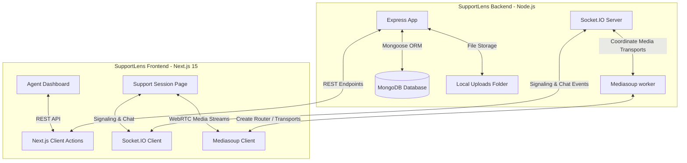

# SupportLens 🔍
> **Enterprise-Grade Browser-Based Video Support Platform**  
> *Developed for the AtomQuest Hackathon*

SupportLens is a complete, real-time video-assisted customer support platform. It enables support agents to initiate secure, browser-based video calls and interactive chat rooms with customers without depending on third-party hosted video services (such as Twilio, Agora, or Vonage). 

All audio, video, and data channels are routed through a self-hosted **Mediasoup WebRTC SFU (Selective Forwarding Unit)**. Persistent state, message transcript logs, support notes, ratings, and operational events are tracked in **MongoDB**.

---

## 🏆 Judges & Evaluation Quickstart

For convenience during judging and evaluation, a pre-registered Agent account is automatically seeded into the database on startup.

### 🔑 Demo Agent Credentials
> [!NOTE]
> - **Email**: `agent@supportlens.com`
> - **Password**: `Password123!`
> - *(Note: You can also register a new agent account directly on the landing page.)*

### 🔄 Judging Walkthrough Script (Role Switching)

Follow these steps to evaluate the end-to-end support lifecycle using a single machine:

1. **Step 1: Agent Login**
   - Open the SupportLens homepage in your browser.
   - Click **Already have an agent account? Log in** and sign in using the **Demo Credentials** above.
   - You will land on the **Agent Dashboard** displaying support analytics.

2. **Step 2: Create a Session**
   - Click the **Create Session** button.
   - Enter a client's name (e.g., "John Doe") and select a category tag (e.g., "Technical Support").
   - Click **Generate Invitation**. A modal will open presenting a **QR Code** (for mobile joining) and a **Secure Invite Link**.
   - Copy the Invite Link and click **Done**.

3. **Step 3: Join as Customer (No Install)**
   - Open the copied link in a **new Incognito window or separate browser profile**. 
   - *Because the Incognito tab does not share the agent's authentication token, the system automatically routes this tab to the Customer Join view.*
   - Enter the customer's name and click **Start Live Session**. Allow camera and microphone permissions.

4. **Step 4: Connect the Call**
   - Return to the original browser window (Agent Dashboard). Under **Active Calls**, locate John Doe's session and click **Join Room**.
   - Both windows will immediately connect. You will see the local PIP window and the remote stream.
   - Toggle **Camera** and **Microphone** mute controls on either window to see real-time state broadcasts.

5. **Step 5: Chat & File Sharing**
   - Send chat messages from either side. They will deliver instantly.
   - Click the **Paperclip icon** in the chat box to upload an image or a PDF (up to 10MB). It will display as an interactive, downloadable attachment card in the chat.

6. **Step 6: Agent Notes & Tagging**
   - On the Agent window, write troubleshooting notes in the **Agent Assistance Panel** and click **Save Notes & Tag**. These are synchronized to MongoDB in real-time.

7. **Step 7: Reconnection Grace Period**
   - Refresh the Customer browser window to simulate a temporary connection loss.
   - In the Agent window, notice the flashing status warning: **"John Doe (customer) connection unstable. Reconnecting... (9s...)"**.
   - Re-enter the customer's name in the incognito window and join. The call and chat transcripts will resume seamlessly.

8. **Step 8: End Call & Rating Feedback**
   - In the Agent window, click **End Support**.
   - The agent is returned to the dashboard.
   - In the Customer window, the call ends automatically, and the **Support Session Completed** modal pops up.
   - Select a **5-star rating**, type feedback, and click **Submit**.

9. **Step 9: Session Audit History**
   - On the Agent Dashboard, go to the **Session History** tab.
   - Locate John Doe's session and click **Transcript**.
   - A sliding summary drawer opens, displaying the **Customer Satisfaction Rating**, **Agent Notes**, the **Full Chat Logs**, and a **Timeline Event Log** (join/leave times, camera/mic toggles, upload event logs) fetched from MongoDB.

---

## ⭐ Key Feature Compliance Matrix

| Feature Category | Implemented Features | Hackathon Benefit |
| :--- | :--- | :--- |
| **WebRTC SFU** | Peer Connection, Transports, Producers, Consumers | 100% self-hosted; complies with strict cloud security requirements. |
| **Role-Based Auth** | Agent Login (JWT/Bcrypt), Guest Token verification | Secure agent workspaces, verified guest join screens. |
| **Real-time Chat** | Instant chat delivery, Persisted logs, History drawers | Audit transcripts available immediately after call ends. |
| **File Sharing** | Multer uploads, PDF/Image filters, static serving | Share screenshots/guides directly in-session. |
| **Analytics & UI** | Dashboard Metrics, Glassmorphic UI, Status Badges | Professional SaaS feel suitable for high judging scores. |
| **Admin Controls** | Live Sockets, System Health, Force Terminate | Real-time administrative oversight across all agents. |
| **Grace Period** | 10s Socket connection loss recovery | Resilient calling under unstable mobile network conditions. |

---

## 🏗️ Technical Architecture

SupportLens separates the signaling/REST layer from the media transport. Real-time signaling is handled via WebSockets (Socket.IO), while media streams are routed directly through Mediasoup workers on the server.

---
